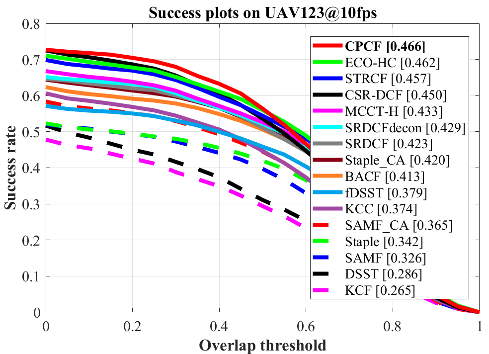
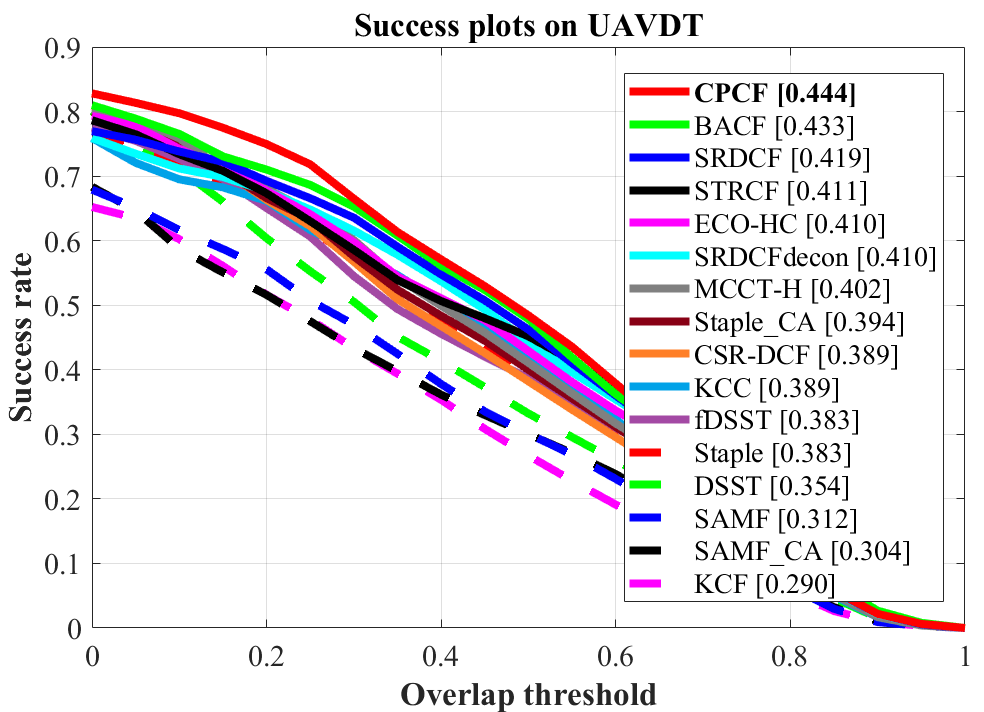
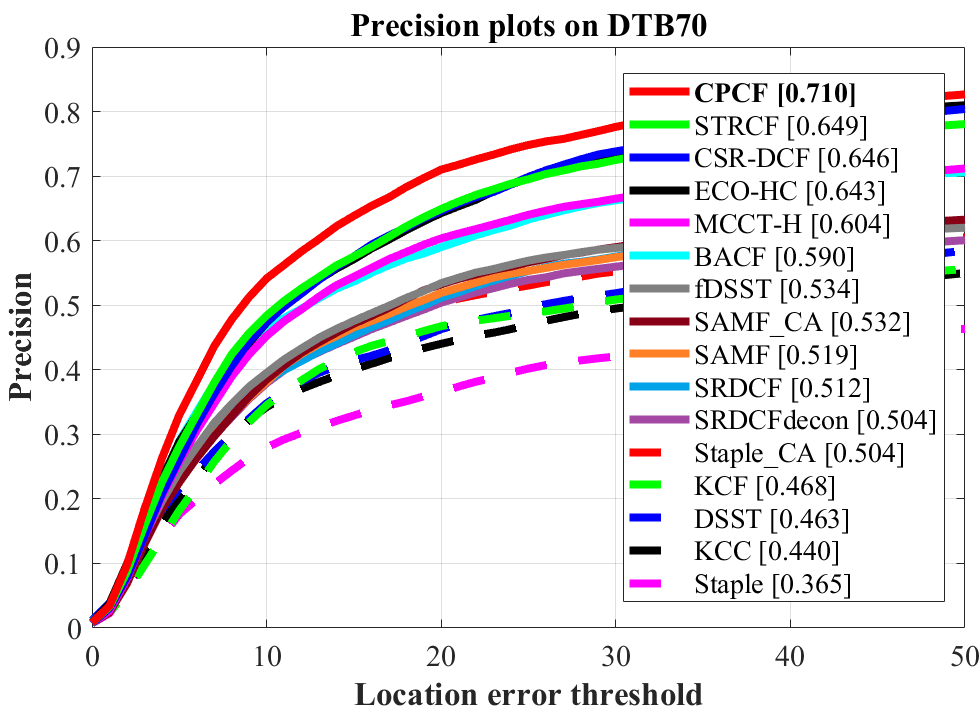
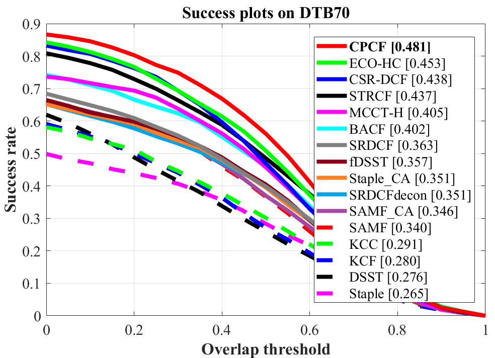

# Learning Consistency Pursued Correlation Filters for Real-Time UAV Tracking

Matlab implementation of our Consistency Pursued Correlation Filters (CPCF) tracker.

| **Test passed**                                              |
| ------------------------------------------------------------ |
|  |

# Abstract 
>Correlation filter (CF)-based methods have demonstrated exceptional performance in visual object tracking for unmanned aerial vehicle (UAV) applications, but suffer from the undesirable boundary effect. To solve this issue, spatially regularized correlation filters (SRDCF) proposes the spatial regularization to penalize filter coefficients, thereby significantly improving the tracking performance. However, the temporal information hidden in the response maps is not considered in SRDCF, which limits the discriminative power and the robustness for accurate tracking. This work proposes a novel approach with dynamic consistency pursued correlation filters, ie, the CPCF tracker.  Specifically, through a correlation operation between adjacent response maps, a practical consistency map is generated to represent the consistency level across frames. By minimizing the difference between the practical and the scheduled ideal consistency map, the consistency level is constrained to maintain temporal smoothness, and rich temporal information contained in response maps is introduced. Besides, a dynamic constraint strategy is proposed to further improve the adaptability of the proposed tracker in complex situations. Comprehensive experiments are conducted on three challenging UAV benchmarks, ie, UAV123@10FPS, UAVDT, and DTB70. Based on the experimental results, the proposed tracker favorably surpasses the other 25 state-of-the-art trackers with real-time running speed (~43FPS) on a single CPU. 	
# Publication

CPCF tracker is proposed in our paper for IROS2020. Detailed explanation of our method can be found in the paper:

Changhong Fu, Xiaoxiao Yang, Fan Li, Changjing Liu, and Peng Lu.

Learning Consistency Pursued Correlation Filters for Real-Time UAV Tracking.

This paper has been accpeted by IROS2020. You can find it at: https://arxiv.org/abs/2008.03704.

If you want to refer to this paper, please cite it as:

@article{Fu2020Learn,

author = {Changhong Fu and Xiaoxiao Yang and Fan Li and Juntao Xu and Changjing Liu and Peng Lu},

title = {Learning Consistency Pursued Correlation Filters for Real-Time UAV Tracking},

year = {2020},

journal= {arXiv:2008.03704}

}

# Contact 
Changhong Fu

Email: changhong.fu@tongji.edu.cn

Xiaoxiao Yang

Email: yxxxxx@tongji.edu.cn

# Demonstration running instructions

Just download the package, extract it and follow two steps:
1. Config the seq name in `configSeqs_demo_for_CPCF.m`,
2. Run `CPCF_tracker_demo.m`, and the CPCF Demo should be running.

>This code is compatible with UAV123 benchmark. Therefore, if you want to run it in benchmark, just put CPCF folder in `trackers`, and config sequences and trackers according to instructions from UAV123. 

# Results on UAV datasets

### UAV123@10fps

### UAVDT

### DTB70

# Acknowledgements

We thank the contribution of `Hamed Kiani`, `Feng Li`, Dr. `Martin Danelljan` for their previous work BACF, STRCF and ECO. The feature extraction modules are borrowed from the ECO tracker (https://github.com/martin-danelljan/ECO) and STRCF tracker (https://github.com/lifeng9472/STRCF) and some of the parameter settings and functions are borrowed from BACF (www.hamedkiani.com/bacf.html) and STRCF.

