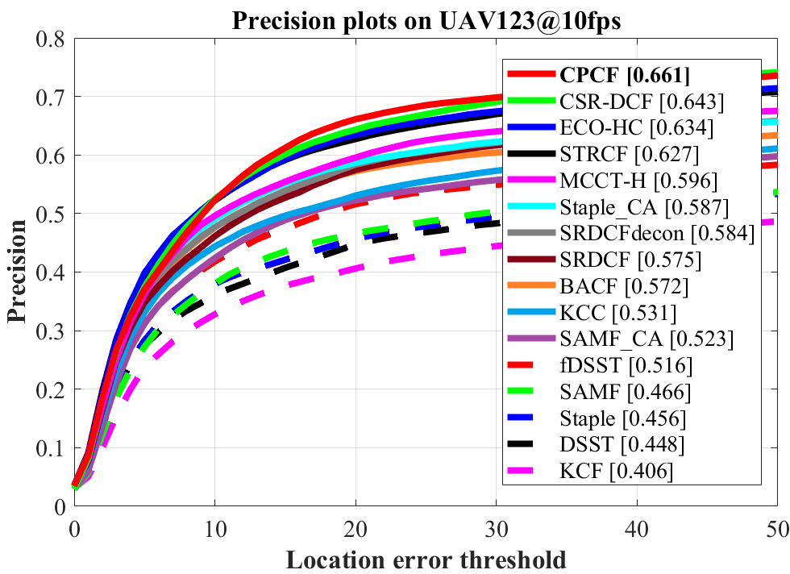
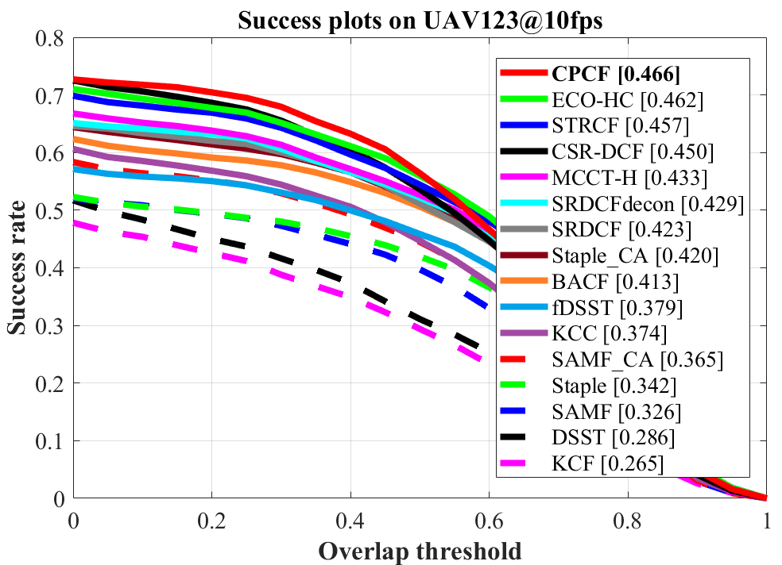
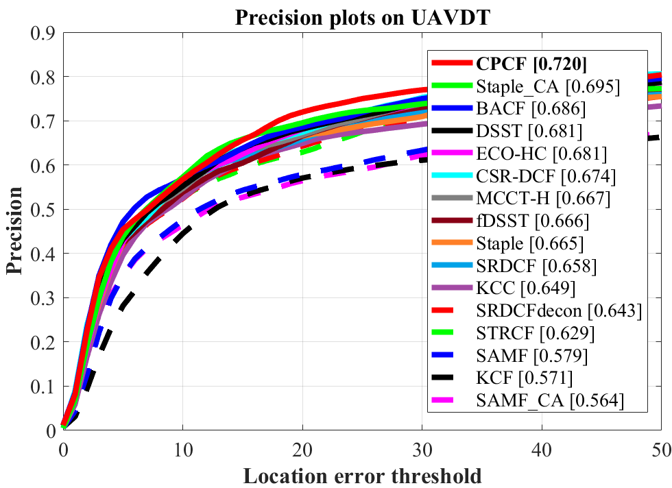
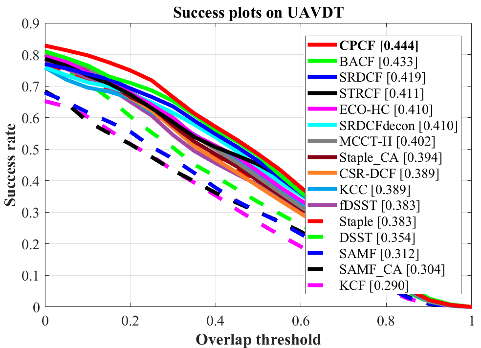
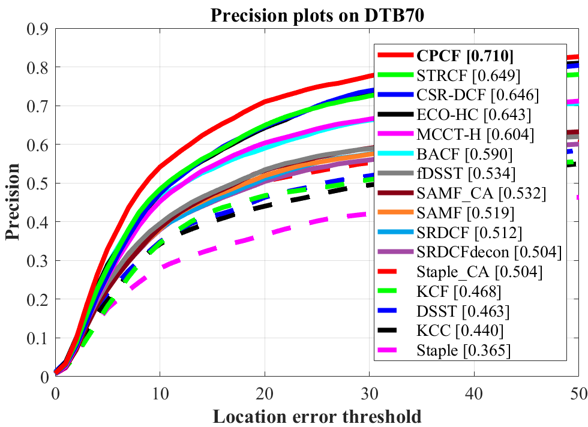
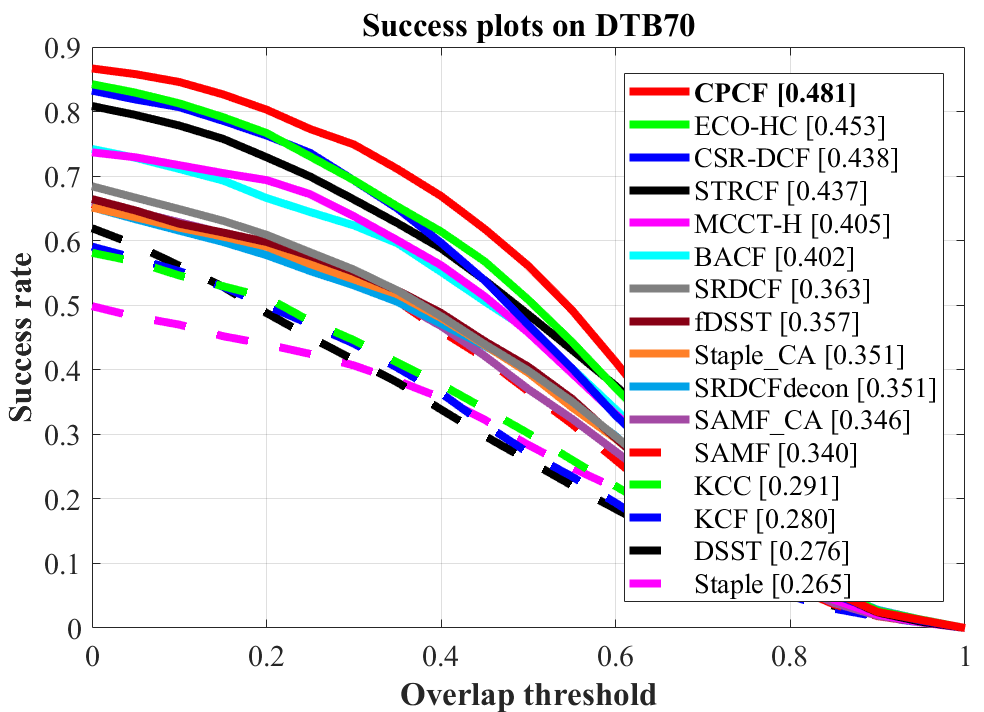

# Real-Time UAV Object Tracking with Dynamic Consistency Pursued Correlation Filters

Matlab implementation of our Consistency Pursued Correlation Filters (CPCF) tracker.

| **Test passed**                                              |
| ------------------------------------------------------------ |
| |

# Abstract 
>Correlation filter (CF)-based methods have demonstrated exceptional performance in visual object tracking for unmanned aerial vehicle (UAV) applications, but suffer from undesirable boundaries. To solve this issue, Spatially Regularized discriminative correlation filters (SRDCF) propose the spatial regularization to pena lize CF coefficients, thereby significantly improving tracking performance. However, the temporal information hidden in the response maps is not considered, which limits the discriminative power and robustness for accuracy object tracking. In this work, we propose a novel approach with dynamic consistency pursued correlation filters, i.e., the CPCF tracker.  Specifically, through a correlation operation between adjacent response maps, the consistency level between them is represented as a practical consistency map. By minimizing the difference between the practical and the scheduled ideal consistency maps, the consistency level is constrained and teeming temporal information contained in response maps is introduced. Besides, a dynamic consistency constraint strategy is proposed to further improve the adaptability of the proposed tracker to complex situations. Comprehensive experiments are conducted on three challenging UAV benchmarks, i.e., UAV123@10fps, UAVDT, and DTB70. Based on the experimental results, the proposed tracker surpasses the other 30 state-of-the-art trackers with real-time average speed (~43fps) on a single CPU. 

# Publication

CPCF tracker is proposed in our paper for TSP. 
Detailed explanation of our method can be found in the paper:

Changhong Fu, Xiaoxiao Yang, Fan Li, Changjing Liu, and Peng Lu.

Real-Time UAV Object Tracking with Dynamic Consistency Pursued Correlation Filters.

# Contact 
Changhong Fu

Email: changhong.fu@tongji.edu.cn

Xiaoxiao Yang

Email: yxxxxx@tongji.edu.cn

# Demonstration running instructions

Just download the package, extract it and follow two steps:
1. Config the seq name in `configSeqs_demo_for_CPCF.m`,
2. Run `CPCF_tracker_demo.m`,
and the CPCF Demo should be running.

>This code is compatible with UAV123 benchmark. Therefore, if you want to run it in benchmark, just put CPCF folder in `trackers`, and config sequences and trackers according to instructions from UAV123. 

# Results on UAV datasets

### UAV123@10fps

### UAVDT

### DTB70

# Acknowledgements

We thank the contribution of `Hamed Kiani`, `Feng Li`, Dr. `Martin Danelljan` for their previous work BACF, STRCF and ECO. The feature extraction modules are borrowed from the ECO tracker (https://github.com/martin-danelljan/ECO) and STRCF tracker (https://github.com/lifeng9472/STRCF) and some of the parameter settings and functions are borrowed from BACF (www.hamedkiani.com/bacf.html) and STRCF.

