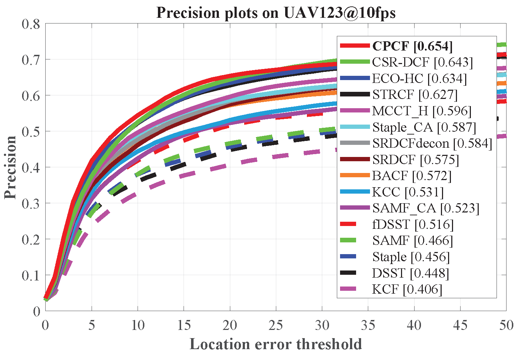
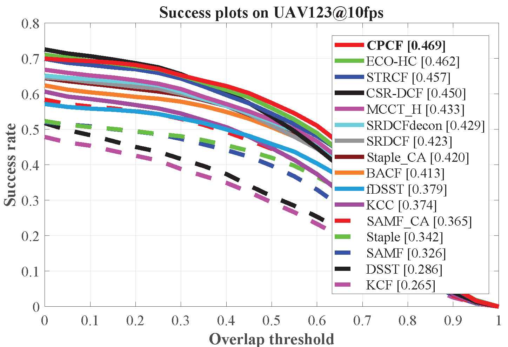
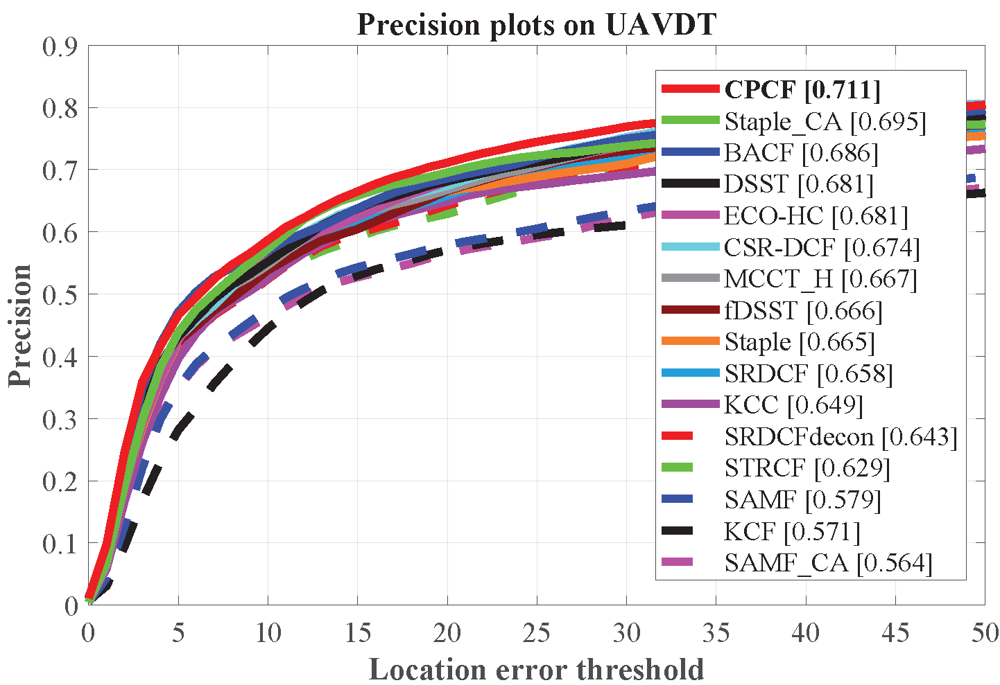
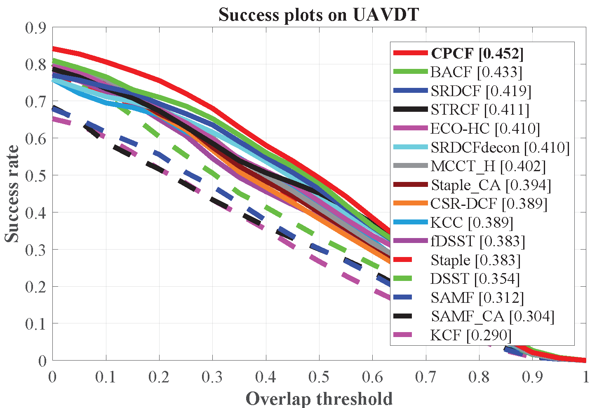
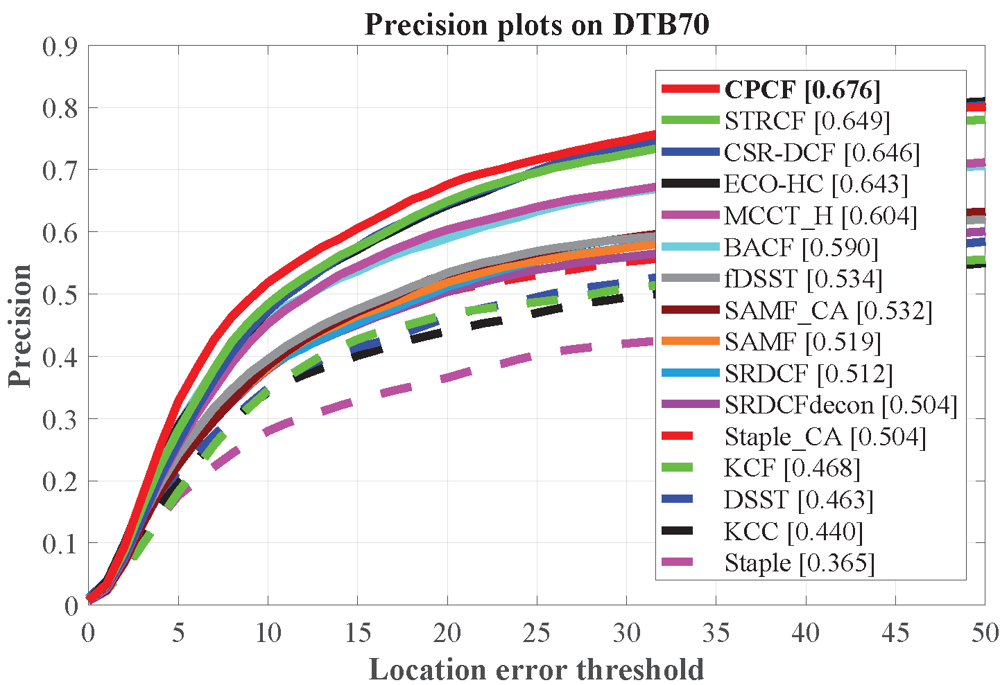
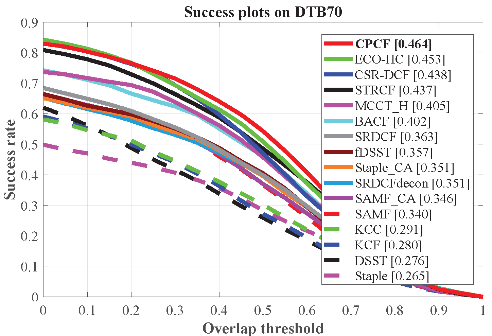

# Learning Consistency Pursued Correlation Filters for Real-Time UAV Tracking 

Matlab implementation of our Consistency Pursued Correlation Filters (CPCF) tracker.

| **Test passed**                                              |
| ------------------------------------------------------------ |
| |

# Abstract 
>Correlation filter (CF) has proven its superb efficiency in visual tracking for unmanned aerial vehicle (UAV) applications. To enhance the temporal smoothness of the filter, many CF-based approaches introduce temporal regularization terms to penalize the variation of coefficients in an element-wise manner. However, this element-wise smoothness is stiff to the filter coefficients and can lead to poor adaptiveness in case of various challenges, e.g., fast motion and viewpoint changes, which frequently occur in the UAV tracking process. To tackle this issue, this work introduces a novel tracker with consistency pursed correlation filter, i.e., CPCF tracker. It is able to achieve flexible temporal smoothness by evaluating the similarity between two consecutive response maps with a correlation operation. By correlation operations, the consistency constraint allows for flexible variations in the response map without losing temporal smoothness. Besides, a dynamic label function is introduced to further increase adaptiveness in the training process. Considerable experiments on three challenging UAV tracking benchmarks verify that the presented tracker has surpassed the other 25 state-of-the-art trackers with satisfactory speed (~25 FPS) for real-time applications on a single CPU.

# Publication

CPCF tracker is proposed in our paper for IROS2020. 
Detailed explanation of our method can be found in the paper:

Changhong Fu, Xiaoxiao Yang, Fan Li, Changjing Liu, and Peng Lu.

Learning Consistency Pursued Correlation Filters for Real-Time UAV Tracking.

# Contact 
Changhong Fu

Email: changhong.fu@tongji.edu.cn

Xiaoxiao Yang

Email: yxxxxx@tongji.edu.cn

# Demonstration running instructions

Just download the package, extract it and follow two steps:
1. Config the seq name in `configSeqs_demo_for_CPCF.m`,
2. Run `CPCF_tracker_demo.m`,
and the CPCF Demo should be running.

>This code is compatible with UAV123 benchmark. Therefore, if you want to run it in benchmark, just put CPCF folder in `trackers`, and config sequences and trackers according to instructions from UAV123. 

# Results on UAV datasets

### UAV123@10fps

### UAVDT

### DTB70

# Acknowledgements

We thank the contribution of `Hamed Kiani`, `Feng Li`, Dr. `Martin Danelljan` for their previous work BACF, STRCF and ECO. The feature extraction modules are borrowed from the ECO tracker (https://github.com/martin-danelljan/ECO) and STRCF tracker (https://github.com/lifeng9472/STRCF) and some of the parameter settings and functions are borrowed from BACF (www.hamedkiani.com/bacf.html) and STRCF.

